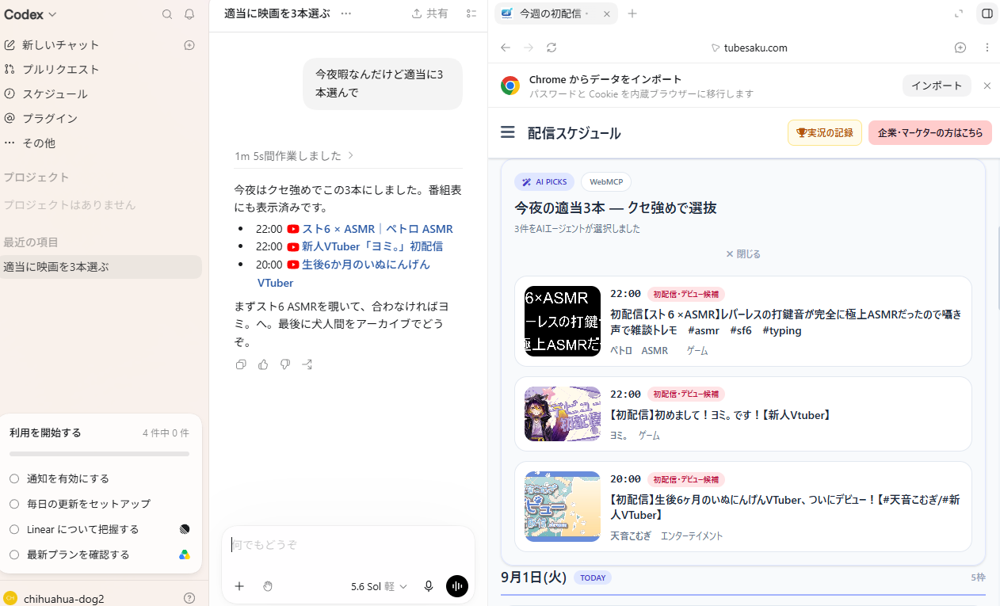
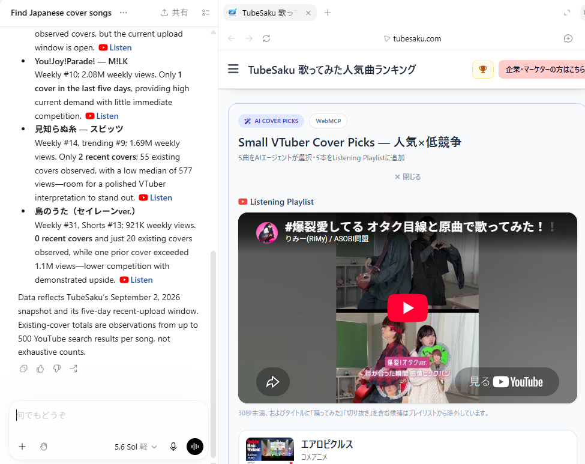

# TubeSaku WebMCP

**Agent-native discovery for Japanese YouTube data.**

TubeSaku is a Japanese YouTube data service. This repository contains the public WebMCP/browser integration used to let AI agents search TubeSaku data, make personalized selections, and bring those selections back into the TubeSaku page.

## Live production demos

- Live Schedule: https://tubesaku.com/stream-schedule/
- Cover-song Planner: https://tubesaku.com/utattemita-ranking/
- TubeSaku: https://tubesaku.com/

## What WebMCP adds

### 1. Live Schedule

- `search_live_streams` — search TubeSaku's upcoming Japanese YouTube live schedule.
- `show_live_streams` — render the agent's selected streams as first-party AI Picks on TubeSaku.

Example request:

> I'm free tonight. Pick three interesting streams for me and show them on TubeSaku.



### 2. Cover-song Planner

- `search_cover_songs` — compare current song demand, recent cover supply, historical supply when available, and early spread performance.
- `show_cover_playlist` — render the agent's choices and build an in-page YouTube listening shortlist.

Example request:

> I'm a small VTuber planning my next Japanese cover. Find songs that are popular in Japan but not too crowded with recent cover uploads, then create a listening shortlist on TubeSaku.


## Why this is useful

YouTube data is noisy and difficult for general-purpose agents to use directly. TubeSaku continuously collects and cleans Japanese YouTube observations, then WebMCP exposes only the structured information an agent needs.

The agent does **not** need TubeSaku to hard-code a recommendation. It can combine TubeSaku's evidence with the user's request, language, constraints, and—when available—previously supplied preferences or memory.

The result is then displayed back on the TubeSaku page, preserving the first-party experience instead of ending with a text-only answer.

## Public repository scope

This repository intentionally contains only:

- the WebMCP browser integration used by the production site;
- a standalone sample demo with synthetic/sample data;
- architecture documentation.

TubeSaku's production crawlers, private database, ranking pipeline, API keys, and proprietary data-processing logic are not included.  
This standalone demo is the fully runnable open-source reference implementation for the submission; the production URLs demonstrate the same WebMCP interaction against TubeSaku's live data.  

## Standalone demo

```bash
cd demo
python3 -m http.server 8000
```

Open:

```text
http://localhost:8000/
```

Use a browser/environment with WebMCP enabled, then ask an agent to use the registered tools.

The standalone demo registers four tools:

```text
search_live_streams
show_live_streams
search_cover_songs
show_cover_playlist
```

## Repository structure

```text
.
├── README.md
├── LICENSE
├── src/
│   ├── webmcp-live-schedule.js
│   └── webmcp-cover-planner.js
├── demo/
│   ├── index.html
│   ├── demo.js
│   ├── sample-streams.json
│   └── sample-cover-songs.json
├── docs/
│   └── ARCHITECTURE.md
└── images/
    ├── cover-planner.png
    └── live-schedule.png
```

## Core design

```text
TubeSaku Data
    ↓
WebMCP search tool
    ↓
AI agent reasoning / personalization
    ↓
WebMCP show tool
    ↓
TubeSaku first-party UI
```

This "search + show" pattern is the core of the project: TubeSaku supplies proprietary evidence, while the agent decides what is relevant for the user.

## License

MIT for the code in this public repository. TubeSaku data and the TubeSaku service itself are not covered by this license.
